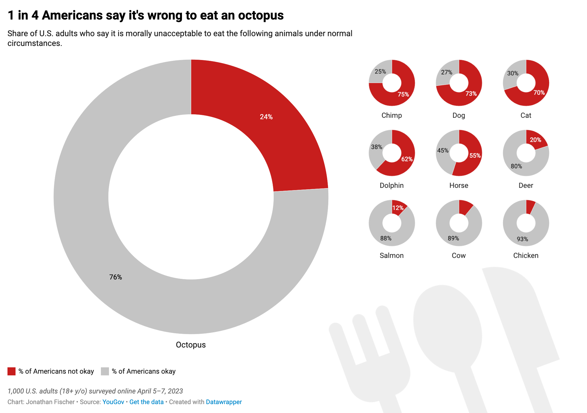

| [home page](https://cmustudent.github.io/tswd-portfolio-templates/) | [data viz examples](dataviz-examples) | [critique by design](critique-by-design) | [final project I](final-project-part-one) | [final project II](final-project-part-two) | [final project III](final-project-part-three) |

# Data visualization redesign: the morality of eating octopus

## Step one: the visualization

 Original infographic by <a href="https://www.statista.com/chartoftheday/">Statista</a>

I thought this was an interesting visualization to crit for a few reasons. The subject matter is accessible, and overall this is actually a fairly clear and easy to understand chart. But there's definitely room for improvement.

## Step two: the critique
This is a pretty effective visualization to begin with, all things considered. It has a fairly clear story and uses a clear, straightforward chart to convey that story. Its use of color is more or less okay and the octopus decal does convey that this is a story about octopi.

The use of a bar chart does not seem as effective to me. We care about a proportion here, so a proportional chart should be used. The use of a highlight color is also smart but the choice of color is too similar to the other bars.

The primary audience for the chart is less clear to me. It's an interesting factoid, but there isn't much of a call to action in the chart itself. I'd add one myself but I'm missing some information on how okay people are eating other non-fish seafood (e.g. squid).

There's actually quite a few things I plan to change here but if I only had to pick 2:

1. Let's use a proportional chart. Since our story is "1 in 4", I actually want to use a pie chart, since the 1/4 proportion will be very clear in that format compared to a proportional bar chart.
2. Use gray for the non-highlight color in the chart — it will draw more attention to the octopus statistic

## Step three: Sketch a solution

Despite being made in Datawrapper, this didn't take very long to make, so I still consider it a sketch.

## Step four: Test the solution

I was only able to conduct one interview with the time I had:

| Question | Interview 1 |
|----------|-------------|
|What are you studying?|Entertainment Industry Management
|What's your initial impression of this chart? What's it saying? |<ul><li>"1 in 4 Americans say it's wrong to eat an octopus..."</li><li>Maybe it's because of culture?</li><li>In some cultures, such as South Korea octopus is served live.</li><li>The other charts compare with animals that aren't traditionally eaten. Are those also about Americans?</li><li>I'd like to see where a frog ranks on this chart. They're pretty similar to a smaller chicken. Some people have probably eaten frog without realizing it!</li><li>I like the graphic in the bottom right.</li></ul>|
|Is there anything you find surprising or confusing?|Deer being at 20% is surprising. Most people I know are [non-Americans] and don't eat deer. It's not a commonly eaten animal to us.
|Who do you think is the intended audience for this?|Uh... PETA? Maybe they'd advocate for these animals.
|Is there anything you would change or do differently?|<ul><li>Maybe try to highlight the 24% part more. It's a smaller number than the 76%, so it loses focus.</li><li>There might also be too many smaller pies.</li><li>The small slices on the pies on the right should have labels</li></ul>

### Synthesis

Overall, the point in the chart is definitely clear. Most confusion seems to come from the limits of the study the data came from — I did dig in deeper myself, but found it fails to establish a link between reasons for not eating animals and not wanting to eat octopus specifically. Frogs weren't in that survey either.

## Step five: build the solution

_Include and describe your final solution here. It's also a good idea to summarize your thoughts on the process overall. When you're done with the assignment, this page should all the items mentioned in the assignment page on Canvas(a link or screenshot of the original data visualization, documentation explaining your process, a summary of your wireframes and user feedback, your final, redesigned data visualization, etc.)._

Overall, I didn't change this a whole lot from the sketch (an advantage of working with a more fully formed sketch, I guess). I still like how the series of pie charts better shows the proportional comparison, so I kept this design.

Per the feedback to emphasize the 24% wedge, I moved it out of the pie and made its label bigger, and added the missing labels from the small pies on the right.

The point of the story is still muddy, but in the absence of a more clear story to tell I didn't want to change it. The survey failed to ask why respondents answered for each animal, so I can't tell if factors like intelligence played into this ranking for octopus or if it's for some other reason (e.g. not eating seafood regularly). The only other oddity I came across is that more people responded strongly to chimpanzees than dogs but it's by such a small margin that I feel emphasizing it is disingenuous. The original data has a breakdown by gender, race, age, and political affiliation too — there's probably a story there too, but I didn't notice any particular trends there. If my goal is to refine the idea of the octopus story as much as possible, there didn't seem to be much else to use, so I stuck with this.

I considered removing some of the other pies, but decided to keep them all as I thought they still made useful reference points while not cluttering the chart too badly. If I had to cut any I'd choose chimp, dolphin, and deer, though I also note that if I had done so the only wild animal left would be the commonly-eaten salmon.

## References
* Original chart from [Statista](https://www.statista.com/chart/30299/us-survey-on-ethics-of-eating-animals/).
* Original data from this [YouGov survey](https://d3nkl3psvxxpe9.cloudfront.net/documents/results_Vegetarianism_and_Eating_Meat.pdf).
* Chart discovered from [Makeover Monday](https://makeovermonday.co.uk/).
* Chart made using [Datawrapper](https://www.datawrapper.de/) and [GIMP](https://www.gimp.org/).
* Fork and knife graphic from [Material Icons](https://fonts.google.com/icons?selected=Material%20Symbols%20Outlined%3Aflatware%3AFILL%400%3Bwght%40400%3BGRAD%400%3Bopsz%4048&icon.query=rest&icon.size=240&icon.color=undefined).

## AI acknowledgements
None used.

