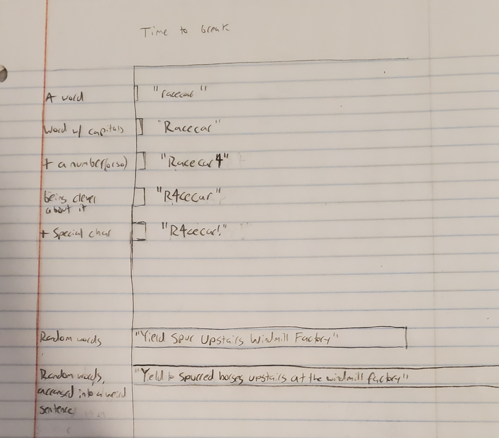

| [home page](https://cmustudent.github.io/tswd-portfolio-templates/) | [data viz examples](dataviz-examples) | [critique by design](critique-by-design) | [final project I](final-project-part-one) | [final project II](final-project-part-two) | [final project III](final-project-part-three) |

## Outline
I want to do a data visualization project looking at various qualities of passwords and comparing those to their “strength”, measured in the amount of time it takes to break them with modern techniques.

I get the sense that both the general public and website owners alike don’t know much about password security. When signing up for new accounts I still see the general advice to “include an uppercase, lowercase, number and special character! Limit 32 characters”. Unfortunately, this advice is outdated and doesn’t actually help much — a sane person will include those things in the lowest effort way possible, to make it easy to remember: by tacking it onto the end and capitalizing the first letter. Modern password cracking attacks use dictionary attacks, where they attempt to guess common words with small modifications — basically, exactly this kind of password. The real way to make a strong password is either complete gobbledygook or to have a seven-word phrase. The former can’t be remembered. The latter is easier to remember, IMO, but won’t work if the site is putting a character limit on their login.

The message I want to get across is twofold, for two different audiences. I may need to focus on only one of them. Given a choice, I want to focus on the latter:

* If you’re a general user, you should prefer a password that contains more words instead of these small modifications.
 * And if the site won’t let you, you should use a password manager that *is* protected by a lot of words.
* If you’re a website developer, your password requirements should both allow the user to enter a very long password and also encourage it in the instructions.

### Project Structure

There is a very big difference in magnitude between a strong and a weak password, so I want to highlight this first to put the rest of the story in context. I'm thinking a bar chart, where we show a series of actual passwords from the data in increasing "strength" according to the old guidelines. Then the last bar is a modern six-word passphrase that goes way off the chart.

I then want to demonstrate that we have a serious problem with poor password strength, or that attackers are getting stronger. This is to help encourage proactivity in security in the reader. Ideas include:

* A pie chart showing the proportion of really weak passwords in the data might be 
* (If data can be found, not shown in sketches) A line chart of number of passwords dumped in cyberattacks by year
* (If data can be found) Chart showing that attackers need less time than ever to crack passwords.

The last part of the arc would include information on how to make a strong password. This may or may not include some information on how attackers crack passwords, but will definitely have an infographic on how to make diceware passphrases and use a password manager.

### Initial sketches

## The data
I can find a lot of data sources with (anonymized!) password data. Most of the ones with a “strength” metric do so by length or presence of the ineffective confounding variables, though. I don’t like that. I want it in an average amount of time it takes to crack that password, since that has a more tangible meaning to someone viewing the project.

There are ways to [estimate the crack time of passwords](https://github.com/mtoplak/Password-strength-meter). I can use something like this on a data set to get crack time numbers if needed. 

I didn't have a chance to look for it yet, but I would like to find historical crack time data, to better illustrate the need for passwords to grow stronger as attackers do too.

| Name | URL | Description |
|------|-----|-------------|
|PWDB Public|   https://github.com/ignis-sec/Pwdb-Public  | Enormous conglomeration of anonymized, leaked passwords           |
|PWLDS| https://github.com/infinitode/pwlds | Synthetically generated passwords, vaguely ranked by strength
|"Password-dataset"|https://github.com/binhbeinfosec/password-dataset| Anonymized leaked passwords vaguely ranked by strength using a tool called [SMMI-PSM](https://www.researchgate.net/publication/380627670_A_Study_on_Markov-based_Password_Strength_Meters)     |
|Password strength meter|https://github.com/mtoplak/Password-strength-meter| Not data itself, but a tool that estimates the strength of an inputted password.           |

## Method and medium
I am currently planning to make a chart-based infographic using Tableau, and maybe some image editing afterwards for graphic design purposes. The data here is largely numerical, and I think an infographic would lend itself to being shared around most easily.

### References
I admit that these are not particularly rigorous references — I did not learn about this topic academically and it was years ago at this point. These will be shored up for later stages of the project.

* [Computerphile: Password Cracking](https://www.youtube.com/watch?v=7U-RbOKanYs)
* [EFF Passphrase word list](https://www.eff.org/dice) — likely to be suggested as a means of action
* Inspiration: [this old XKCD comic](https://xkcd.com/936/)

### AI acknowledgements
No language model output used to write any analysis or text here. (Many password analysis tools are machine-learning based, but I assume this isn't what you're asking about.)
